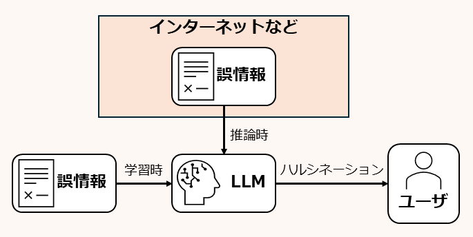
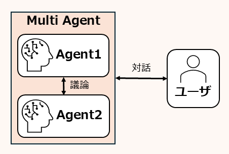
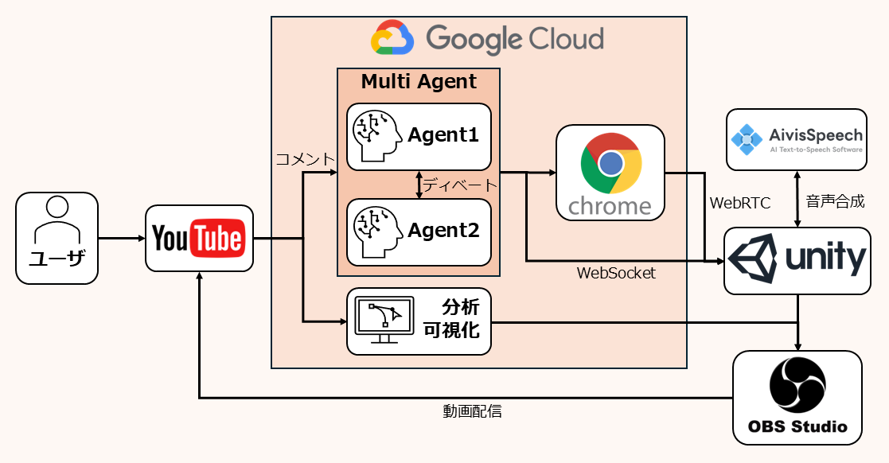

# Chromeを使いながらディベートするマルチエージェントAI Vtuberシステムを作ってみた
## プロジェクト概要
本プロジェクトでは，Chromeを使い，情報収集をしながらディベートするマルチエージェントAI Vtuberシステムを作成しました。\
２人のAIエージェントがYoutube上で、視聴者を交えてインタラクティブなライブ配信を行います．AIエージェントは必要に応じてbrowser-useやReasoningモデル等をツールとして使用するため，正確性の高いレスポンスが得られます．\
また、両者に相反する主張を与えてディベート形式で議論を行わせる機能も備えており，批判的な観点からエージェントのアウトプットを検証できます。\
さらに，エージェントにはシステムプロンプトで任意の性格を付与できるため、必要に応じて論理性を重視した展開にすることも、エンターテインメント性を高め，ライブ配信を楽しめるような展開にすることも可能です。

## 課題とアプローチ
ChatGPTを始めとする高度な対話AIの登場により、私たちはこれまで以上に容易く知りたい情報を得ることができるようになりました。一方で、これらのAIの返答は必ずしも正確なものとは限らず、所謂ハルシネーションの問題は，対話AIの使用における大きな懸念となっています。私たちは、この問題に対して<b>複数のAIエージェントと使用者がインタラクティブにコミュニケーションして正しい情報を模索していく</b>アプローチを提案します。

### 解決を試みる課題
既にハルシネーションは公知の問題であり、これを解決するために多くの努力がなされています．そのため、古いLLMと比べると，現在のLLMはハルシネーションを起こしにくくなっています．\
しかし、モデルの信頼性を上げるだけで，常に正しい情報を得られるようになるとは限りません。

LLMの内部に，必要とされる知識を全て取り込むことは現実的ではないため、より高度な情報提供機能を得るためには必然的にインターネットを介して情報を収集するAIエージェントを考えることになるでしょう。しかし、インターネットには不正確な情報が散乱しており、これらを参照した回答は誤りを含んでしまうことになります。
また、AIの学習段階で好ましくないデータの混入を防ぐことも現実的には困難です。これらの問題は厳密にはハルシネーションとは異なりますが、ユーザーに誤った情報が渡されるという点では同質の問題と言えます。

私たちは、今回のプロジェクトでAIエージェントの使用者が正確な情報に安定してアクセスする方法について考え、この問題に対する一つの解決策を提案します。

### 私たちの課題へのアプローチ
私たちのアプローチの核心は、**AIのみに情報の正確性を担保させるのではなく、ユーザーとAI、さらにはAI同士が相互にコミュニケーションを取ることで、批判的な観点から情報を精査していくべき** というアイデアにあります。

本質的に、ある情報が正確かどうかを判断するのは人間ですが、AIは人類が築いてきた価値判断の基準を解釈し、それに沿った出力を行うよう設計されています。しかし、意見の分かれる話題が多い現実世界において、単一のAIモデルに常に正確な出力を期待するのは困難です。それよりも、本質的な真偽の決定者である**人間がAIと共に情報を収集・精査し、共に正しい答えを構築していくこと**が、理想的なアプローチであると私たちは考えました。AIの出力に対して、批判的な観点から再質問を行い、思考を繰り返すことで最終的な出力の信頼性は向上していくでしょう。

しかし、ユーザーが常にAIの出力に対して批判的な観点を持ち続けるのは大きな負担となります。そこで、**ユーザーの批判的思考を助けるために、AI同士が議論を交わしながら情報を精査する仕組み**を導入しました。あるエージェントの意見に対して、別のエージェントが批判的なコメントを行い、相互に議論を深めることで、より多角的な情報分析が可能になります。このプロセスは、ユーザーにとっても論点を明示的に示し、情報の精査を行う上での取っ掛かりを提供する役割を果たします。

この仕組みにより、従来の「ユーザーとAI」の一方向的な関係ではなく、**ユーザーとAI、そしてAI同士が協調しながら情報を検証する新たなコミュニケーションモデル**が実現されます。ここでは、もはや単なる「アシスタント」と「ユーザー」という主従関係は希薄化し、AIエージェントはユーザーのコラボレーターとして、情報精査のプロセスにおいて対等な立場で効果的にタスクを遂行することが可能になると考えています。

## システムの概要

今回作成したシステムの構成は上の図のようになっています。

各AIエージェントは[LangGraph](https://www.langchain.com/langgraph)を用いて実装されています。推論は主にGemini API in Vertex AIを介して行われています。出力のクオリティを向上するためにエージェントにはThinkとWebSearchという２つのツールが与えられ、状況に応じてエージェントが使用するツールを自ら選択し、活用します。エージェントの発言に一貫性を持たせ、論理的に整合性の取れた議論を行わせるために、エージェントの毎回の発言内容は埋め込みモデルによって圧縮され、chromadbに保管され、新しい応答を生成する際に参照されます。

通常の応答及びツールの選択にはgemini-2.0-flash-expを用いています。

Thinkはより論理的な応答を可能にするためのツールで、gemini-2.0-flash-thinking-exp-1219を用いています。

WebSearchではbrowser_useを用いてエージェントにchromeを操作させ、インターネット上で情報収集を行います。

さらに、ディベートの勝敗判定のために、視聴者からのコメントの文埋め込みを取得し、それをUMAPを用いて２次元に圧縮しています。ここから、各エージェントの主張と各コメントとのユークリッド距離を算出し、より多くのコメントが支持していると推定される主張を優勢と判定しています。

これらのエージェントに関する処理は、GCE上で実行されます。これは、文埋め込みを作成するに当たって多くのGPUによる計算能力が必要となるためです。この部分をクラウド上で実行することにより、スペックの低いPCを使用するユーザーでも問題なくこのシステムを利用できます。一方、後述するライブ配信を実行するツール群はローカルで動作させることによりユーザビリティの向上が見込めるため、クラウド上で実行するすることを選択しませんでした。

視聴者のコメントはYoutubeDataAPIを用いて取得され、コンテキストに応じた前処理を施した上でエージェントに入力されます。

エージェントの発話内容はWebSocket通信によりUnityアプリケーションに送信されます。Unityではエージェントの状態に応じて対応するアバターにモーションを付与し、エージェントの発話に対して音声合成エンジンを用いて声を追加します。また、音声合成の際にはリップシンクの技術を用いてアバターが発話しているように演出を行っています。

UnityアプリケーションにはWebRTCを用いてクラウド上のエージェントが操作しているブラウザとコメントの埋め込みプロットが送信され、Unity側でこれが画面内に配置されます。

最終的に、このUnityアプリケーションの画面をOBSstudioでキャプチャすることで配信が実行されます。

<システム全体の概要について述べる. Gemini API in Vertex AIとGCEを利用していることはそれとなく強調する>

<システムの拡張性，運用可能性，費用対効果について強調する>

### browser-use

### 音声合成

### フロントエンド

### 分析・可視化

### etc

<こまごまとした実装というよりは，ツールを効果的に活用している事を強調したほうがよさそう>

<文字数に余裕があれば，個々の要素に着目して説明を行う>

## 実際の動作

<iframe width="996" height="560" src="https://www.youtube.com/embed/sW598JXSX7s" title="AI Vtuberによるディベート 1.3倍速" frameborder="0" allow="accelerometer; autoplay; clipboard-write; encrypted-media; gyroscope; picture-in-picture; web-share" referrerpolicy="strict-origin-when-cross-origin" allowfullscreen></iframe>

こちらの動画は，実際に本プロジェクトのシステムを用いて，YouTubeで配信を行った時の様子です．\
最初はYouTube配信のコメントに反応しつつ，雑談を行っています．\
その後，視聴者から議題が与えられると，その議題に沿ってディベートを開始します．ブラウザ等を用いて情報収集を行い，柔軟に論理を構築している様子が分かります．

## まとめ
本プロジェクトでは、マルチエージェントによるディベートを通じて、批判的な観点から情報の精査を行い、信頼性の高い情報収集を支援できることをデモンストレーションしました。特に、AIエージェントと人間がより自然に相互コミュニケーションを取れる環境を提供することを目指し、YouTubeという日常的に利用されるプラットフォーム上で、ユーザーフレンドリーなバーチャルアバターを用いたライブ配信形式を採用しました。この形式により、AIエージェントが単なる無機質なコンソール上の存在ではなく、あたかも人格を持つコラボレーターのように感じられる体験を提供し、将来的に人間とAIが共に作業する環境の在り方を示唆しています。

また，本システムでは、複数のエージェントが議論を交わすディベート機能を実装し、ユーザーが議論のテーマを提供しながら、ライブ配信のコメントを通じて間接的に議論に関与できる仕組みを導入しました。さらに、AIエージェントは単なるテキストベースの応答に留まらず、コンテキストに応じたエモーションを出力し、それをUnity上で作成されたアバターに反映させることで、視覚的・聴覚的にリアルな対話体験を実現しました。加えて、リップシンク技術を活用し、エージェントの発話に応じた口の動きを再現することで、まるでオンライン上の人物と対話しているかのような没入感を提供しています。

このように、本プロジェクトは、情報の精査プロセスにおけるAIエージェントの有用性を実証するとともに、より自然でインタラクティブな人間とAIの協働の可能性を示すものとなっています。AI技術の発展が進む中で、私たちはこのシステムが新しいコミュニケーションの形として広がることを期待しています。

## コード
- クラウド側

https://github.com/ONIXION/ai_youtuber.git

- Unity側

https://github.com/ONIXION/ai_youtuber_unity.git